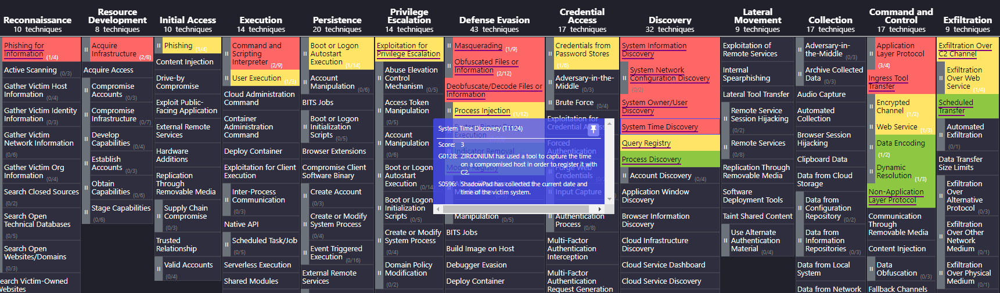
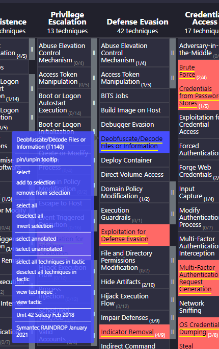

# custom-mitre-layers
Create custom MITRE Navigator layers that embed procedure examples for provided Group or Software IDs.

By default, you can create layers for specific groups, software, and data sources, but it only shows a description of the technique. You can also add a score, but if you do it all on one layer, your score won't account for overlaps between different groups, software, or data sources.

This script programmatically creates navigator layers by utilizing the STIX data that MITRE ATT&CK pulls from and adds all Procedure examples as metadata for each group. The citations are also parsed out and added as links (with dividers between links for different groups/software) so that they are quickly accessible by right clicking on a given technique. Scores are also calculated based on the number of overlaps.

# TODO
- implement default color scheme so that lower scores are green and higher scores are red
- implement commandline paramter for group ids (be case insensitive)
