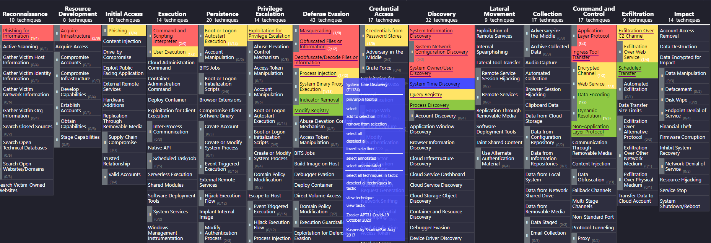
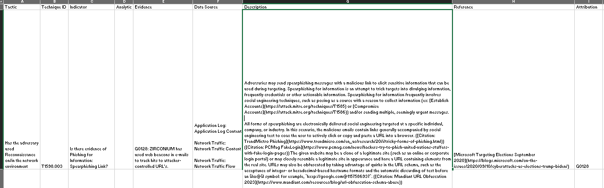
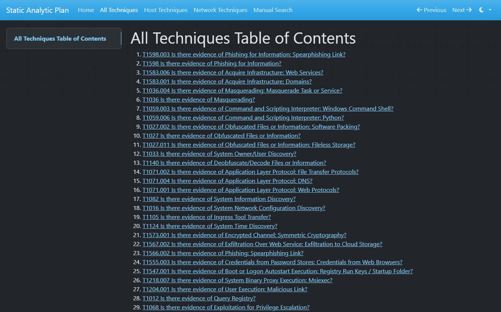
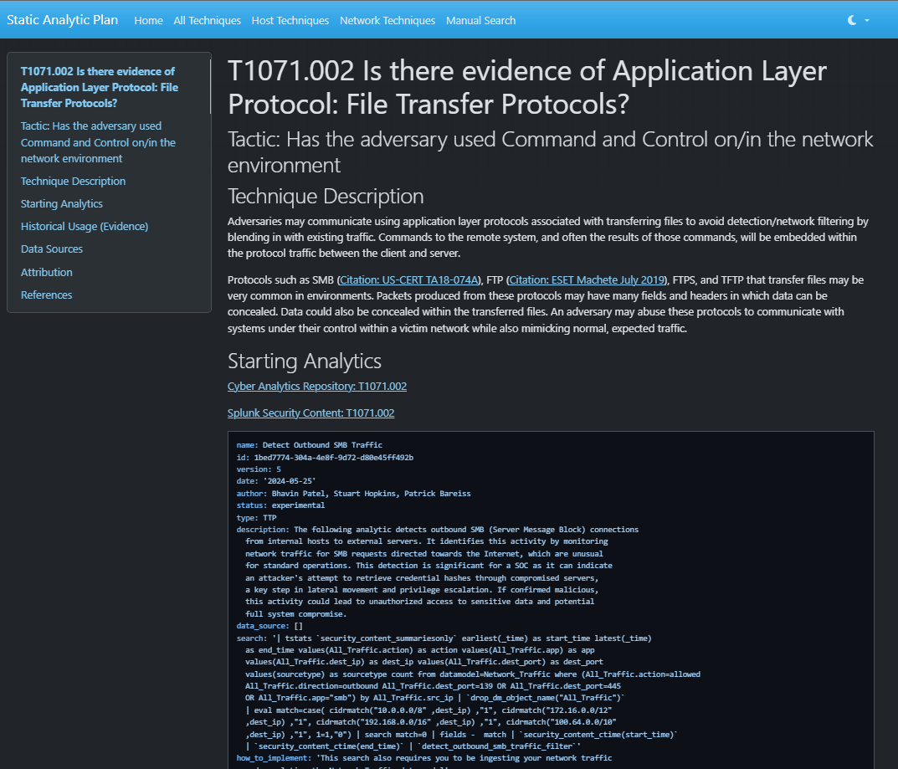

# Layer Analytic Generator (LAG)

## Screenshots of Products

*Merged Navigator Layer Showing Multiple Technique Procedures*

*Merged Navigator Layer with Direct Links to Procedure References*

*Snip of CSV Analytic Plan*

*Static Analytic Plan Web View*

*Example Technique View from Web View* 

## Problem
- Analytic plans take time to develop
- ATT&CK Navigator does not include procedure information and reference links in the metadata of technique when layers are merged in the GUI app
- There is no way to take a Navigator (json) layer as input and output an Analytic plan
- Analytic plan CSVs are too difficult to scroll and navigate when case management platforms are not available

## Solution/Features
- Get a merged, colored, sorted, and annotated Navigator layer from Group and Software IDs for use in briefings and presentations; enables quick overview of expected TTPs and kill-chain in addition to high-value techniques to hunt for first
	- Procedures for each Technique are included in the metadata for a Technique and viewable when hovering over a Technique
	- Links to references for a Technique or Procedure are available on right-click of a technique for quick access
	- Provide a custom Navigator Layer if Group or Software IDs don't align with the threat you will be hunting and it will be merged in for the overall Navigator layer, which will then feed into the Analytic plan CSV as well
- Get Analytic plan CSV from just a list of relevant MITRE ATT&CK Group and Software IDs, which are open-source groupings of Techniques and Procedures (specifically how a Technique was used by a group)
	- Analytic plan CSV includes Technique description, relevant Procedures, and links to open-source analytics that detect the Technique to minimize window/tab switching for an analyst
	- Techniques will be ordered and prioritized based on the number of overlaps across Group and Software IDs as this indicates that an analyst will be more likely to observe it
	- Group and Software IDs can be weighted so that a Technique associated with a higher weighted Group ID will be prioritized higher than a Technique associated with a lower weighted Group ID, all else equal; this allows the inclusion of highly relevant and less relevant IDs without diluting the priority techniques
- Get Static Web Analytic plan
	- Provides better viewing experience by organizing information vertically (no horizontal scrolling) and formatting using Markdown for better readability and navigation across different Techniques
	- Some open-source analytics are pulled and displayed directly on the page so that the analyst doesn't have to navigate off the page to read the analytic
	- Can be opened and viewed locally through a browser without any additional software; can be optionally hosted on any web server (e.g. Nginx, Apache)

## Usage
1. Get a list of Group and Software IDs based on available threat intelligence
2. Create a custom Navigator layer if there are any gaps with Group and Software IDs
3. Open lag.ipynb in Google Colab (or equivalent)
4. Run the first two grouped cell blocks labeled "Install Dependencies..." and "Get all STIX"
	- In the first grouped cell block, periodically (at least every 3 months) update mitreattack-python package, but test for any breaking changes or features/methods that are not backwards compatible; version is explicitly specified to prevent getting the latest version before testing
5. Open up the grouped cell block labeled "Choose Group or Software IDs..."
	- Update the comma-separated (no space) string of IDs and update the multipliers (number of multiplier values should match number of IDs)
	- Add in the filename of any custom Navigator layers that you want merged in
	- Click the folder icon on the left margin of the page and drag and drop the Navigator json layer into the environment
	- Update the coverage URLs that the script uses to reference repositories
6. Run "Get Procedure Examples" and "Create Layer" cell blocks
	- "layer.json" Navigator layer will be available in your environment filesystem (folder icon on left margin of page), you can download by right-clicking on file
	- Google "attack navigator," "Open Existing Layer," and "Upload from local" to view the layer
7. Run the next two blocks: "Import ATT&CK Navigator Layer..." and "Process Each Field into RAGE Format..."
	- You will have CSV version of Analytic plan in the environment filesystem, this version does not have the analytics in plaintext as the newlines will break the CSV formatting in Excel and not display properly
8. Run the final block labeled "Static Web Analytic plan"
	- By default, it is configured to create local-only web files
	- You can change it to create files intended to be hosted on a web server by commenting out "config_text" with comment above it saying "...planning on viewing locally"
	- Download "site.zip" from the filesystem to your desktop
	- Unzip, double click on "index.html" to get to the home page
9. For hosting the files on a web server, I recommend using a simple Nginx container and copying the directory into the Nginx web directory; I'll leave the specifics as an exercise to the reader
	
## Notes
- When there are any changes to the environment filesystem and you don't see the change, click the refresh button at the top of the filesystem viewer
- Code is grouped under Markdown title cells, click ">" arrow on left to ungroup and regroup cells
- Click the "Play" button to run all code blocks in a grouped cell block
- If a Technique belongs to multiple Tactics, one is chosen from a list called "tactics_priority" under "Create Layer" block
- Scoring for sub-techniques and "major" techniques is set to "show aggregate scores" and uses the sum aggregate function in Navigator by default for the most accurate visualization when sub-techniques are not expanded

## Future Works:
- Update Navigator and Layer version as necessary
- Generic Pivoting Guide for junior analysts: a flow chart or add-on to Analytic plan that will provide ideas on what to look at next if they find something suspicious to include the data source
	- e.g. given a bad IP, you can look at that bad IP across the entire network to see what other hosts have been connecting to it, you can look at the protocol and see if the port/protocol is being used malicious by different IP somewhere else, you can try to find the responsible service/implant/scheduled task that is causing the network connection, etc
- Develop and implement flow of intelligence from report to TRAM (Threat Report ATT&CK Mapper, automated processing of PDF or article urls to read the text and output a Navigator layer of mentioned techniques) to Navigator layer to LAG; would enable streamlined creation of custom Navigator layers if Group or Software ID does not accurately align with expected threat
	- [TRAM](https://github.com/center-for-threat-informed-defense/tram)
- Use the developed Analytic plan/Navigator layer to design a Threat Emulation Exercise via Caldera; Caldera can emulate a list of Techniques in a given network environment, which could better prepare analysts before going on a hunt; the hard problem for this is the network traffic simulation and user emulation of the network, potential solution is [GHOSTS](https://github.com/cmu-sei/GHOSTS)
	- [Caldera](https://github.com/mitre/caldera)
- Integrations for analytics sources beyond Splunk Security to display them directly on a Technique page instead of just providing hyperlinks; potentially work around is to download analytics repositories from GitHub and host it locally so that analyst doesn't have to reach out to internet to view analytic
- Develop robust dashboards that can be used repeatedly for high-value techniques without much change in Procedures (Command and Control is better candidate vs Exploit Public-Facing Application) and reference dashboards in addition to analytics in Analytic plan
- Improvement in code formatting and organization, it is not the most readable or the most efficient
