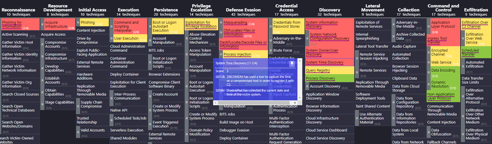
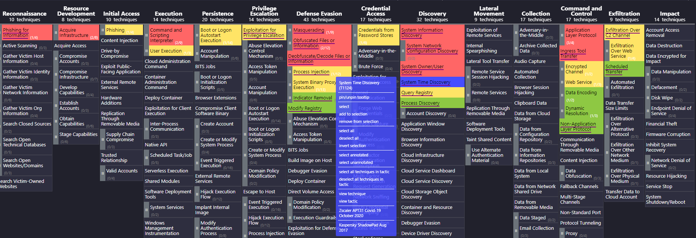
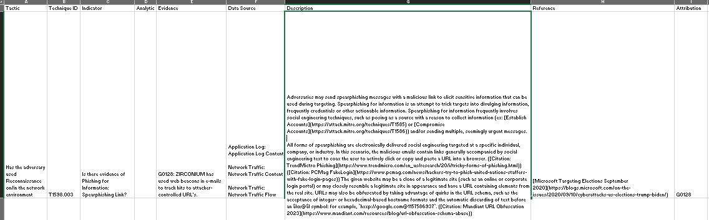
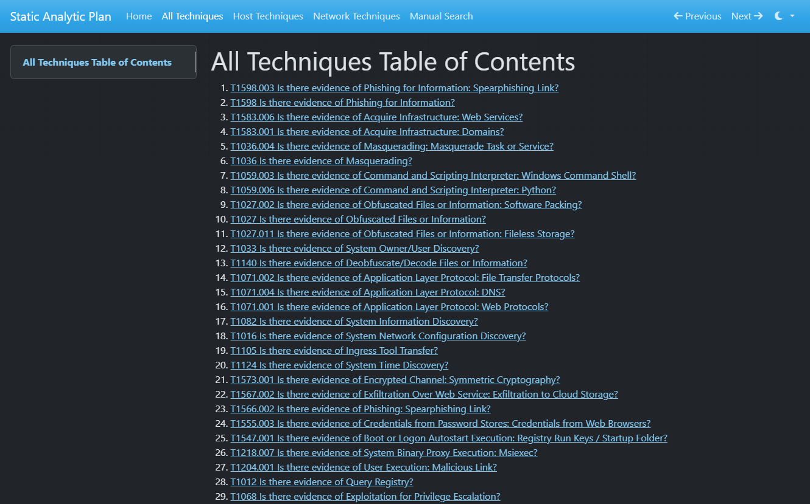
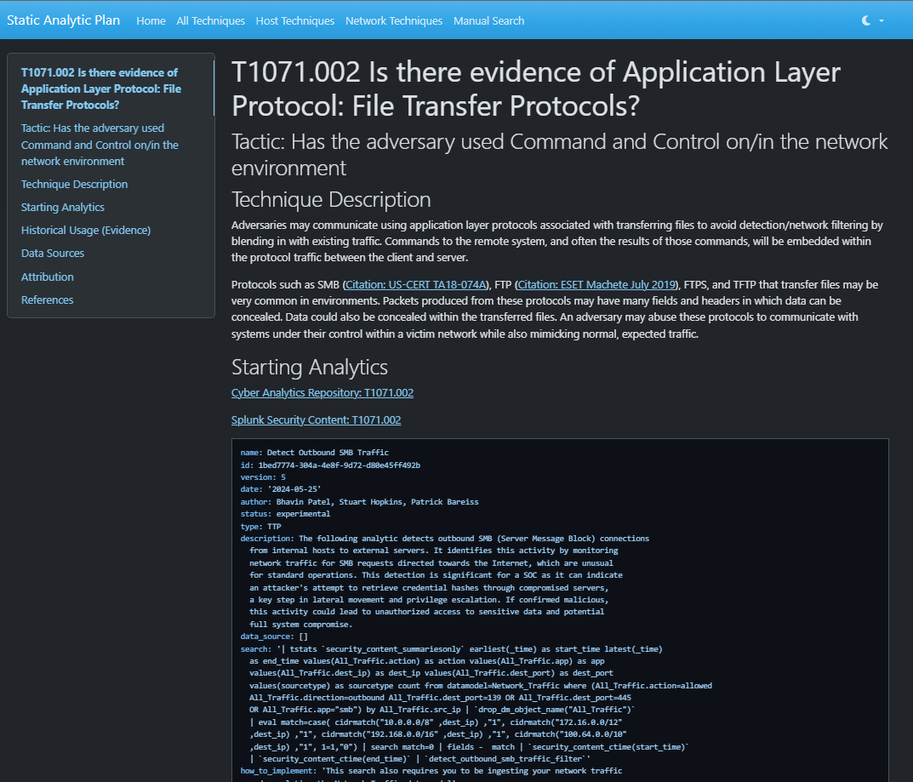

# Layer Analytic Generator (LAG)

Version 2.0 rewrites LAG as a proper Python package and CLI (`lag`), replacing the 2024 Colab
notebook as the primary way to run it. The notebook is still available (`lag.ipynb`) as a thin
wrapper around the same package for people who prefer Colab.

## Screenshots of Products

*The screenshots below are from v1 (the Colab notebook). The v2 outputs are the same shape
(a Navigator layer, a CSV plan, and a static site) but the plan now also surfaces ATT&CK's
native detection strategies and analytics, and a technique shows up under every tactic it
belongs to instead of just one.*



*Merged Navigator Layer Showing Multiple Technique Procedures*



*Merged Navigator Layer with Direct Links to Procedure References*



*Snip of CSV Analytic Plan*



*Static Analytic Plan Web View*



*Example Technique View from Web View*

## Problem
- Analytic plans take time to develop
- ATT&CK Navigator does not include procedure information and reference links in the metadata of a technique when layers are merged in the GUI app
- There is no way to take a Navigator (json) layer as input and output an Analytic plan
- Analytic plan CSVs are too difficult to scroll and navigate when case management platforms are not available

## Solution/Features
- Get a merged, colored, sorted, and annotated Navigator layer from Group, Software, and Campaign IDs for use in briefings and presentations; enables quick overview of expected TTPs and kill-chain in addition to high-value techniques to hunt for first
	- Procedures for each Technique are included in the metadata for a Technique and viewable when hovering over a Technique
	- Links to references for a Technique or Procedure are available on right-click of a technique for quick access
	- A technique is shown under every tactic it belongs to (no `tactic` key is written to the layer), instead of the v1 behavior of picking one tactic per technique
	- Provide a custom Navigator Layer if Group, Software, or Campaign IDs don't align with the threat you will be hunting and it will be merged in for the overall Navigator layer, which will then feed into the Analytic plan CSV as well
- Get Analytic plan CSV from just a list of relevant MITRE ATT&CK Group, Software, and Campaign IDs, which are open-source groupings of Techniques and Procedures (specifically how a Technique was used by a group, tool, or campaign)
	- Analytic plan CSV includes Technique description, relevant Procedures, and links to open-source analytics that detect the Technique to minimize window/tab switching for an analyst
	- Analytics now come from ATT&CK's own detection strategies and analytics (`x-mitre-detection-strategy` / `x-mitre-analytic` / `x-mitre-data-component`), plus the MITRE CAR analytics repository and the JPCERT/CC Tool Analysis Result Sheet, matched by whole-word tool name
	- The host vs. network split in the plan is now driven by the ATT&CK data components attached to a technique's analytics (configurable, see `network_data_components` below), instead of the free-text "data sources" field v1 used
	- Techniques will be ordered and prioritized based on the number of overlaps across Group, Software, and Campaign IDs as this indicates that an analyst will be more likely to observe it
	- IDs can be weighted so that a Technique associated with a higher weighted ID will be prioritized higher than a Technique associated with a lower weighted ID, all else equal; this allows the inclusion of highly relevant and less relevant IDs without diluting the priority techniques
- Get Static Web Analytic plan
	- Provides better viewing experience by organizing information vertically (no horizontal scrolling) and formatting using Markdown for better readability and navigation across different Techniques
	- Starting analytics (detection strategies, CAR, JPCERT tools) are pulled and displayed directly on the page so that the analyst doesn't have to navigate off the page to read the analytic
	- Can be opened and viewed locally through a browser without any additional software; can be optionally hosted on any web server (e.g. Nginx, Apache)
- Everything above is driven by a single TOML config file and a `lag` command line tool, and can run fully offline against a local ATT&CK STIX bundle and a warm cache

Splunk Security Content integration has been removed for now (see Future Works below); it may
return later as an optional add-on rather than a hard dependency.

## Quick start

Requires Python 3.11+.

```bash
pip install "git+https://github.com/sko9370/Layer-Analytic-Generator"
lag init                 # writes plan.toml with every option commented, in the current directory
# edit plan.toml: fill in your Group/Software/Campaign IDs and weights
lag build -c plan.toml
```

`lag build` writes `layer.json`, `analytic_plan.csv`, and (unless disabled) a static `site/` plus
`site.zip` into `output/` (or whatever `output_dir` you configured). Run `lag --help`,
`lag init --help`, or `lag build --help` for the full option list; the most commonly used
`lag build` flags are:

- `-c, --config PATH`: the TOML config file (defaults to built-in defaults with no sources, so you
  normally need this or `--source`)
- `--source ID=WEIGHT` (repeatable): add or override a source without editing the file, e.g.
  `--source G0128=2 --source S0596`; weight defaults to `1` when omitted
- `--offline`: never touch the network, fail if something isn't already cached or local
- `--stix-file PATH`: parse a local STIX bundle instead of downloading one
- `--output-dir PATH`: override `output_dir`
- `--no-site`: skip building the static site
- `-v`: verbose (INFO-level) logging; warnings are always shown

## Google Colab usage

If you'd rather not install a local Python environment, open `lag.ipynb` in
[Google Colab](https://colab.research.google.com/) (File > Upload notebook, or open it directly
from GitHub). The notebook is a thin wrapper: it installs the package from GitHub, lets you edit a
Python dict of sources, weights, and options, calls the same `lag.pipeline.run()` the CLI uses, and
downloads the resulting files to your machine. To use a custom Navigator layer, use the folder icon
in the left margin to upload the layer JSON into the Colab environment's filesystem before running
the config/build cells, and reference its filename in the `custom_layers` entry.

## Configuration reference

`lag init` writes an example file with every option below, commented, as a starting point. All
paths are resolved relative to the config file's own directory. Unknown keys anywhere in the file
are rejected (to catch typos).

```toml
name = "Analytic Plan"      # title used in the layer and the site
domain = "enterprise-attack" # ATT&CK domain to pull from
output_dir = "output"        # where layer.json, analytic_plan.csv, and site/ are written

[sources]                    # ATT&CK Group (G####), Software (S####), or Campaign (C####) ID = positive integer weight
G0128 = 2
S0596 = 1

[[custom_layers]]            # optional, repeatable: merge in your own Navigator layer(s)
path = "custom.json"
label = "Observed Activity"  # used as the source label for techniques that only appear here

[attack]
version = ""                 # "" = latest release; or pin a version like "19.2"
stix_file = ""                # "" = download; or point at a local STIX bundle to skip the network
cache_dir = ".lag_cache"      # where downloaded STIX/analytics data is cached
offline = false               # true = never touch the network; fail if something isn't cached/local

[analytics]
car = true                    # include MITRE CAR analytics-by-technique coverage
car_coverage_url = "..."      # CAR coverage JSON (Navigator layer format)
jpcert = true                  # include JPCERT/CC Tool Analysis Result Sheet matches
jpcert_tool_list_url = "..."  # JPCERT tool list HTML
network_data_components = ["Network Connection Creation", "Network Traffic Content", "Network Traffic Flow"]
# data component names that mark a technique as "network" rather than "host" in the plan

[layer]
gradient = ["#8ec843ff", "#ffe766ff", "#ff6666ff"]  # low -> high score colors (Navigator layer gradient)

[site]
enabled = true       # build the static MkDocs site in addition to the layer and CSV
mode = "local"        # "local" (open index.html straight from disk) or "hosted" (behind a web server, with search)
zip = true             # also produce site.zip
```

Validation runs when the config is loaded: source IDs must match `G####`/`S####`/`C####`
(case-insensitive, normalized to upper case), weights must be positive integers, you need at least
one source or custom layer, `site.mode` must be `local` or `hosted`, and `gradient` needs at least
two `#RRGGBB` or `#RRGGBBAA` colors.

## Outputs

- **`layer.json`**: an ATT&CK Navigator layer (layer format 4.5). Open it at
  [https://mitre-attack.github.io/attack-navigator/](https://mitre-attack.github.io/attack-navigator/)
  via **Open Existing Layer > Upload from local**. Hover a technique for procedure metadata; right-click
  it for reference links. Techniques appear under every tactic they belong to.
- **`analytic_plan.csv`**: one row per technique (Tactic, Technique ID, Technique, Score, Category,
  Indicator, Analytic, Evidence, Data Components, Description, Reference, Attribution), sorted by
  priority. Saved as `utf-8-sig` so it opens cleanly in Excel.
- **`site/`** and **`site.zip`**: a static MkDocs site of the plan, one page per technique plus
  All/Host/Network/Search index pages.
  - `site.mode = "local"` produces a site you can unzip and open `index.html` directly from disk
    (no `use_directory_urls`, no search plugin).
  - `site.mode = "hosted"` produces a site meant to sit behind a real web server: directory-style
    URLs and a search index. To host it, copy the unzipped `site/` directory into the web root of
    any server, for example an Nginx container (`docker run -v ./site:/usr/share/nginx/html:ro -p 8080:80 nginx`),
    or copy it into an existing server's document root.

## How scoring and ordering work

Each source (Group, Software, Campaign, or imported custom layer) contributes its configured weight
once per technique it has a procedure for; a technique referenced by several sources accumulates
each source's weight, so overlap across your threat intelligence pushes a technique's score up.
Imported custom layer entries are merged in the same way, adding to score and appending procedures
without duplicating links.

For ordering, techniques are grouped by parent technique (a technique with no sub-technique
relationship groups with itself). Groups are sorted by their total score (parent + all
sub-techniques) descending, so a technique family with many contributing procedures floats to the
top even if any single sub-technique's own score is lower than another technique's. Within a group,
techniques are sorted by individual score descending, then by technique ID.

## Development

```bash
python -m venv .venv && source .venv/bin/activate
pip install -e ".[dev]"
pytest              # unit tests, no network access
pytest -m live       # also exercises the live ATT&CK/CAR/JPCERT endpoints; run this periodically
                     # to catch upstream schema changes, not on every commit
ruff check src tests
ruff format src tests
```

## Notes
- `lag init` refuses to overwrite an existing config file unless you pass `--force`.
- If a Technique belongs to multiple Tactics, it is now shown under all of them in the Navigator
  layer rather than a single prioritized one.
- Scoring for sub-techniques and "major" techniques uses Navigator's "show aggregate scores" with
  the sum aggregate function by default, for the most accurate visualization when sub-techniques
  are not expanded.
- Offline runs (`--offline` or `attack.offline = true`) need a warm cache (`cache_dir`) or a local
  `stix_file`; otherwise the run fails with a clear error naming what's missing.

## Future Works
- Update Navigator and Layer version as necessary
- Generic Pivoting Guide for junior analysts: a flow chart or add-on to Analytic plan that will provide ideas on what to look at next if they find something suspicious to include the data source
	- e.g. given a bad IP, you can look at that bad IP across the entire network to see what other hosts have been connecting to it, you can look at the protocol and see if the port/protocol is being used malicious by different IP somewhere else, you can try to find the responsible service/implant/scheduled task that is causing the network connection, etc
- Develop and implement flow of intelligence from report to TRAM (Threat Report ATT&CK Mapper, automated processing of PDF or article urls to read the text and output a Navigator layer of mentioned techniques) to Navigator layer to LAG; would enable streamlined creation of custom Navigator layers if Group, Software, or Campaign ID does not accurately align with expected threat
	- [TRAM](https://github.com/center-for-threat-informed-defense/tram)
- Use the developed Analytic plan/Navigator layer to design a Threat Emulation Exercise via Caldera; Caldera can emulate a list of Techniques in a given network environment, which could better prepare analysts before going on a hunt; the hard problem for this is the network traffic simulation and user emulation of the network, potential solution is [GHOSTS](https://github.com/cmu-sei/GHOSTS)
	- [Caldera](https://github.com/mitre/caldera)
- Splunk Security Content as an optional add-on again, displaying matching detections directly on a Technique page instead of just providing hyperlinks; potentially download the analytics repository from GitHub and host it locally so an analyst doesn't have to reach out to the internet to view an analytic
- Sigma rule matching, as a vendor-neutral complement to CAR and Splunk Security Content
- A self-contained single-file HTML version of the plan (no MkDocs build, no separate site directory) for easier sharing over email or chat
- XLSX export of the analytic plan, with the newline-safe formatting the CSV export needs to avoid
- Support for the ICS and Mobile ATT&CK domains, not just Enterprise
- Develop robust dashboards that can be used repeatedly for high-value techniques without much change in Procedures (Command and Control is a better candidate vs. Exploit Public-Facing Application) and reference dashboards in addition to analytics in Analytic plan
- Improvement in code formatting and organization, it is not the most readable or the most efficient
