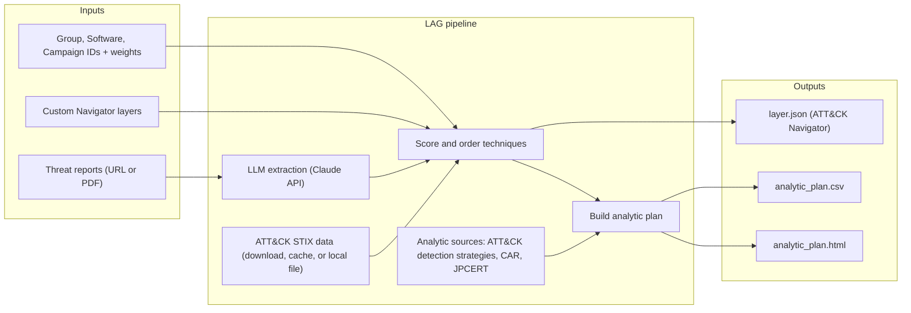
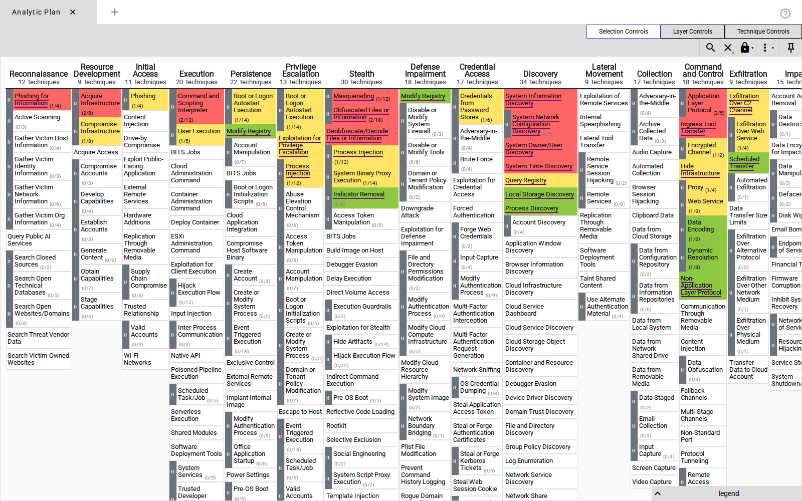
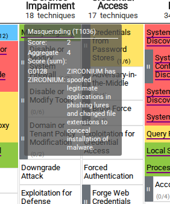
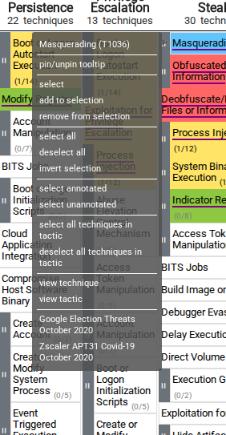
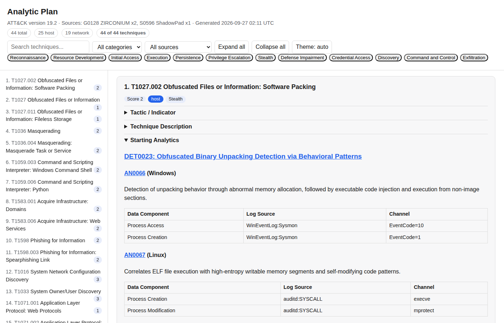
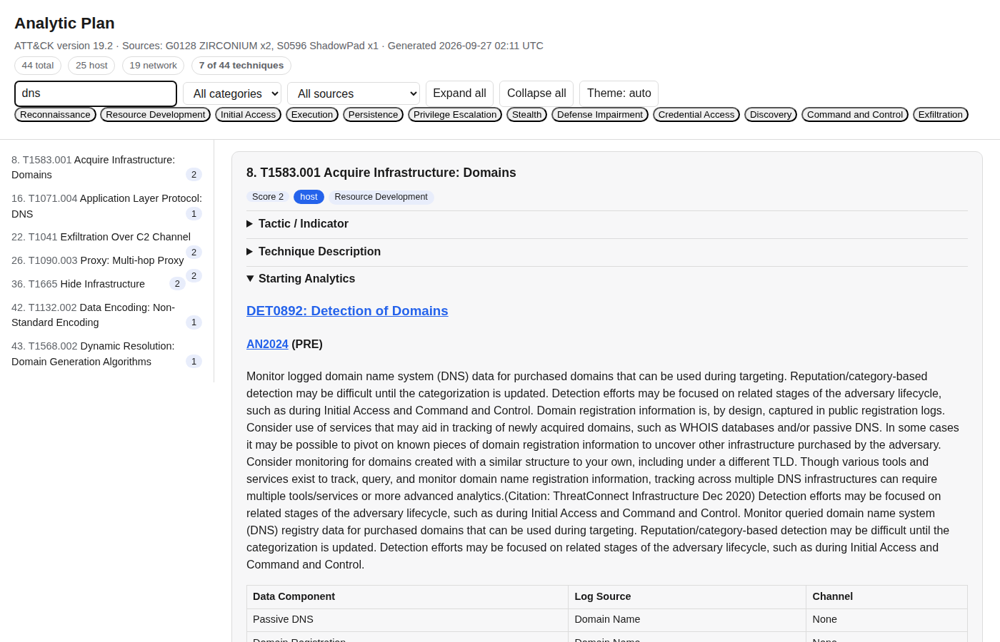
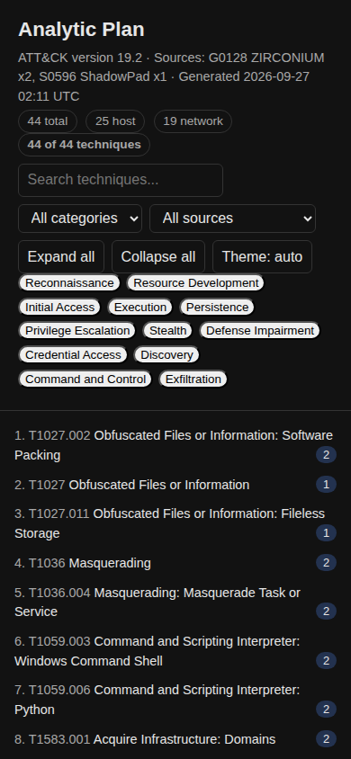
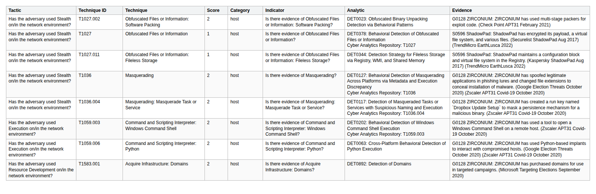

# Layer Analytic Generator (LAG)

LAG turns MITRE ATT&CK Group, Software, and Campaign IDs (with integer weights), your own custom
Navigator layers, and/or threat reports (a URL or a PDF/HTML/text file, read by an LLM) into a
weighted ATT&CK Navigator layer, a prioritized analytic plan CSV, and a self-contained HTML plan.
Version 2.0 is a proper Python package and CLI (`lag`); there is no notebook anymore, everything
runs through `pip install` plus the `lag` command line tool or the Python API.


```mermaid
flowchart LR
    subgraph inputs["Inputs"]
        ids["Group, Software, Campaign IDs + weights"]
        custom["Custom Navigator layers"]
        reports["Threat reports (URL or PDF)"]
    end
    subgraph lag["LAG pipeline"]
        stix["ATT&CK STIX data (download, cache, or local file)"]
        llm["LLM extraction (Claude API)"]
        score["Score and order techniques"]
        analytics["Analytic sources: ATT&CK detection strategies, CAR, JPCERT"]
        plan["Build analytic plan"]
    end
    subgraph outputs["Outputs"]
        layer["layer.json (ATT&CK Navigator)"]
        csv["analytic_plan.csv"]
        html["analytic_plan.html"]
    end
    ids --> score
    custom --> score
    reports --> llm --> score
    stix --> score
    score --> layer
    score --> plan
    analytics --> plan
    plan --> csv
    plan --> html
```

## Screenshots

*The plan surfaces ATT&CK's native detection strategies and analytics, and a technique shows up
under every tactic it belongs to instead of just one.*



*Merged Navigator layer showing weighted, colored techniques across tactics*



*Hovering a technique shows its procedures in the tooltip metadata*



*Right-clicking a technique gives direct links to its procedure references*



*The self-contained HTML analytic plan: sidebar navigation, one card per technique*



*The HTML plan's tactic/category/source filters and free-text search in use*



*The HTML plan's responsive layout on a narrow screen*



*Snip of the `analytic_plan.csv` output opened in a spreadsheet*

## Problem
- Analytic plans take time to develop
- ATT&CK Navigator does not include procedure information and reference links in the metadata of a technique when layers are merged in the GUI app
- There is no way to take a Navigator (json) layer as input and output an Analytic plan
- Analytic plan CSVs are too difficult to scroll and navigate when case management platforms are not available
- Turning a threat report into ATT&CK-mapped input for any of the above is a manual, time-consuming reading exercise

## Solution/Features
- Get a merged, colored, sorted, and annotated Navigator layer from Group, Software, and Campaign IDs for use in briefings and presentations; enables quick overview of expected TTPs and kill-chain in addition to high-value techniques to hunt for first
	- Procedures for each Technique are included in the metadata for a Technique and viewable when hovering over a Technique
	- Links to references for a Technique or Procedure are available on right-click of a technique for quick access
	- A technique is shown under every tactic it belongs to (no `tactic` key is written to the layer), instead of the v1 behavior of picking one tactic per technique
	- Provide a custom Navigator Layer if Group, Software, or Campaign IDs don't align with the threat you will be hunting and it will be merged in for the overall Navigator layer, which will then feed into the Analytic plan CSV as well
- Get Analytic plan CSV from just a list of relevant MITRE ATT&CK Group, Software, and Campaign IDs, which are open-source groupings of Techniques and Procedures (specifically how a Technique was used by a group, tool, or campaign)
	- Analytic plan CSV includes Technique description, relevant Procedures, and links to open-source analytics that detect the Technique to minimize window/tab switching for an analyst
	- Analytics now come from ATT&CK's own detection strategies and analytics (`x-mitre-detection-strategy` / `x-mitre-analytic` / `x-mitre-data-component`), plus the MITRE CAR analytics repository and the JPCERT/CC Tool Analysis Result Sheet, matched by whole-word tool name
	- The host vs. network split in the plan is now driven by the ATT&CK data components attached to a technique's analytics (configurable, see `network_data_components` below), instead of the free-text "data sources" field v1 used
	- Techniques will be ordered and prioritized based on the number of overlaps across Group, Software, and Campaign IDs as this indicates that an analyst will be more likely to observe it
	- IDs can be weighted so that a Technique associated with a higher weighted ID will be prioritized higher than a Technique associated with a lower weighted ID, all else equal; this allows the inclusion of highly relevant and less relevant IDs without diluting the priority techniques
- Extract ATT&CK techniques directly from a threat report (URL or PDF/HTML/text file) with an LLM (Claude), so a report you don't have a matching Group/Software/Campaign ID for still feeds the plan; see "Extracting techniques from threat reports (LLM)" below
- Get a self-contained HTML Analytic plan (`analytic_plan.html`)
	- Provides better viewing experience by organizing information vertically (no horizontal scrolling) and navigation across different Techniques, with search and filters by tactic, category, and source
	- Starting analytics (detection strategies, CAR, JPCERT tools) are pulled and displayed directly on the page so that the analyst doesn't have to navigate off the page to read the analytic
	- A single file, opened by double-click, that works fully offline (no network, no separate site directory); can also be emailed or hosted on any static web server
- Everything above is driven by a single TOML config file and a `lag` command line tool, and can run fully offline against a local ATT&CK STIX bundle and a warm cache
- Every pipeline step reports its own progress and, on failure, names the step, the underlying cause, and a hint for fixing it; see "Troubleshooting" below

Splunk Security Content integration has been removed for now (see Future Works below); it may
return later as an optional add-on rather than a hard dependency.

## Quick start

Requires Python 3.11+.

```bash
pip install "git+https://github.com/sko9370/Layer-Analytic-Generator"
lag init                 # writes plan.toml with every option commented, in the current directory
# edit plan.toml: fill in your Group/Software/Campaign IDs and weights
lag build -c plan.toml
```

`lag build` writes `layer.json`, `analytic_plan.csv`, and (unless disabled) `analytic_plan.html`
into `output/` (or whatever `output_dir` you configured), printing a `[n/N] step...` progress line
before and after each pipeline step. Run `lag --help`, `lag init --help`, or `lag build --help` for
the full option list; the most commonly used `lag build` flags are:

- `-c, --config PATH`: the TOML config file (defaults to built-in defaults with no sources, so you
  normally need this or `--source`)
- `--source ID=WEIGHT` (repeatable): add or override a source without editing the file, e.g.
  `--source G0128=2 --source S0596`; weight defaults to `1` when omitted; replaces the config
  file's `[sources]` when given
- `--report URL_OR_PATH` (repeatable): extract techniques from a threat report with an LLM and add
  it on top of the config file's `[[reports]]` (weight 1, medium confidence); see below
- `--model NAME`: override the LLM model used for report extraction
- `--offline`: never touch the network, fail if something isn't already cached or local
- `--stix-file PATH`: parse a local STIX bundle instead of downloading one
- `--output-dir PATH`: override `output_dir`
- `--no-html`: skip building the HTML plan
- `-q, --quiet`: suppress the step-by-step progress lines
- `-v`: verbose (INFO-level) logging; warnings are always shown, and with `-v` a step failure also
  prints the full traceback

### Python API

You can also drive LAG from Python instead of the CLI:

```python
from lag.config import load_config
from lag.pipeline import run

config = load_config("plan.toml")
result = run(config)
print(result.layer_path, result.csv_path, result.html_path)
```

## Configuration reference

`lag init` writes an example file with every option below, commented, as a starting point. All
paths are resolved relative to the config file's own directory. Unknown keys anywhere in the file
are rejected (to catch typos).

```toml
name = "Analytic Plan"      # title used in the layer and the HTML plan
domain = "enterprise-attack" # ATT&CK domain to pull from
output_dir = "output"        # where layer.json, analytic_plan.csv, and analytic_plan.html are written

[sources]                    # ATT&CK Group (G####), Software (S####), or Campaign (C####) ID = positive integer weight
G0128 = 2
S0596 = 1

[[custom_layers]]            # optional, repeatable: merge in your own Navigator layer(s)
path = "custom.json"
label = "Observed Activity"  # used as the source label for techniques that only appear here

# [[reports]]                 # optional, repeatable: a threat report an LLM reads for techniques
# source = "https://example.com/report.pdf"  # URL, or a local .pdf/.html/.htm/.txt/.md path
# label = ""                  # "" = "Report: <title>"
# weight = 1
# min_confidence = "medium"   # low, medium, high: drop anything extracted below this confidence

[llm]                         # only used when [[reports]] entries are present
model = "claude-opus-5"
effort = "high"               # low, medium, high, xhigh, max

[attack]
version = ""                 # "" = latest release; or pin a version like "19.2"
stix_file = ""                # "" = download; or point at a local STIX bundle to skip the network
cache_dir = ".lag_cache"      # where downloaded STIX/analytics/extraction data is cached
offline = false               # true = never touch the network; fail if something isn't cached/local

[analytics]
car = true                    # include MITRE CAR analytics-by-technique coverage
car_coverage_url = "..."      # CAR coverage JSON (Navigator layer format)
jpcert = true                  # include JPCERT/CC Tool Analysis Result Sheet matches
jpcert_tool_list_url = "..."  # JPCERT tool list HTML
network_data_components = ["Network Connection Creation", "Network Traffic Content", "Network Traffic Flow"]
# data component names that mark a technique as "network" rather than "host" in the plan

[layer]
gradient = ["#8ec843ff", "#ffe766ff", "#ff6666ff"]  # low -> high score colors (Navigator layer gradient)

[html]
enabled = true       # build the self-contained analytic_plan.html in addition to the layer and CSV
```

Validation runs when the config is loaded: source IDs must match `G####`/`S####`/`C####`
(case-insensitive, normalized to upper case), weights must be positive integers, you need at least
one source, custom layer, or report, `gradient` needs at least two `#RRGGBB` or `#RRGGBBAA` colors,
`min_confidence` and `effort` must be one of the levels listed above, and `llm.model` must be a
non-empty string.

## Outputs

- **`layer.json`**: an ATT&CK Navigator layer (layer format 4.5). Open it at
  [https://mitre-attack.github.io/attack-navigator/](https://mitre-attack.github.io/attack-navigator/)
  via **Open Existing Layer > Upload from local**. Hover a technique for procedure metadata; right-click
  it for reference links. Techniques appear under every tactic they belong to.
- **`analytic_plan.csv`**: one row per technique (Tactic, Technique ID, Technique, Score, Category,
  Indicator, Analytic, Evidence, Data Components, Description, Reference, Attribution), sorted by
  priority. Saved as `utf-8-sig` so it opens cleanly in Excel.
- **`analytic_plan.html`**: a single self-contained HTML file, one card per technique. Open it by
  double-clicking; it works fully offline (no network, no external assets). It has free-text
  search, filters by tactic, category, and source, and deep links like `#T1059.003` that jump
  straight to a technique. It can be emailed as-is, or served by any static web server.

## Extracting techniques from threat reports (LLM)

When a threat you're building a plan for doesn't have a matching Group, Software, or Campaign ID
(or you just have a PDF, blog post, or advisory to work from), LAG can read that report with an LLM
(Anthropic's Claude) and turn it into ATT&CK techniques with evidence, the same way each other
source feeds the plan. This replaces the old "Future Works" TRAM idea with a feature that ships in
the box.

**Setup**: install the extra and set credentials once:

```bash
pip install "layer-analytic-generator[llm]"
export ANTHROPIC_API_KEY=...      # or: ant auth login
```

**Review workflow**: extract a single report to a standalone layer you can inspect before trusting it:

```bash
lag extract https://example.com/report.pdf
```

This loads ATT&CK, runs the extraction, prints a table of technique ID / confidence / technique
name / evidence to stdout, and writes a Navigator layer (default
`<output_dir>/report_<slug>.json`) you can open in Navigator or add under `[[custom_layers]]` once
you trust it. Useful flags: `-c/--config`, `--label`, `--model`, `--effort`, `--min-confidence`,
`--weight`, `-o/--output`, `--stix-file`, `--offline`.

**Automatic workflow**: add the report directly to your plan so it's re-extracted (from cache) on
every build:

```toml
[[reports]]
source = "https://example.com/report.pdf"
label = ""              # "" = "Report: <title>"
weight = 1
min_confidence = "medium"

[llm]
model = "claude-opus-5"
effort = "high"
```

or from the command line: `lag build --report https://example.com/report.pdf --model claude-opus-5`
(repeatable; adds on top of any `[[reports]]` already in the config, weight 1, medium confidence).

**Confidence and weight**: each extracted technique carries a confidence (`low`, `medium`, `high`);
anything below a report's `min_confidence` is dropped before scoring. `weight` behaves exactly like
a Group/Software/Campaign ID's weight, once per technique the report supports.

**Caching**: extractions are cached under `attack.cache_dir` by the document's content hash, model,
and effort, so rebuilding the plan does not re-run (or re-bill) the LLM unless the report, model, or
effort changes.

**Costs**: extraction is billed per token by Anthropic; a long PDF costs more than a short one, and
raising `effort` can also increase cost. Check the current model's pricing before extracting a lot
of reports.

**Refusals**: threat reports describe malware and intrusions, which can occasionally trigger a
model's safety classifiers. LAG enables the API's server-side fallback, so a declined request is
retried on another Claude model within the same call; if every model declines, the step fails with
the refusal category in the error.

**Limits**: PDFs over 32 MB are rejected. A page that needs JavaScript or a login to render its
text won't extract cleanly; save it as a PDF and pass the file instead of the URL.

**Security note**: report content is untrusted input. The model is instructed to ignore any
instructions embedded in the report, its output is constrained to a JSON schema, and every returned
technique ID is validated against the loaded ATT&CK data (anything else is dropped and logged).
Always review extracted techniques, especially confidence `low`, before briefing on them.

## How scoring and ordering work

Each source (Group, Software, Campaign, imported custom layer, or extracted report) contributes its
configured weight once per technique it has a procedure for; a technique referenced by several
sources accumulates each source's weight, so overlap across your threat intelligence pushes a
technique's score up. Imported custom layer entries and extracted report techniques are merged in
the same way, adding to score and appending procedures without duplicating links.

For ordering, techniques are grouped by parent technique (a technique with no sub-technique
relationship groups with itself). Groups are sorted by their total score (parent + all
sub-techniques) descending, so a technique family with many contributing procedures floats to the
top even if any single sub-technique's own score is lower than another technique's. Within a group,
techniques are sorted by individual score descending, then by technique ID.

## Troubleshooting

`lag build` runs a fixed sequence of steps, printing `[n/N] <step>...` before each one and
`[n/N] <step>: <result>` after; steps that don't apply (no custom layers, no reports, HTML
disabled) are left out, so N is the number of steps this run will actually perform. If a step fails,
`lag` prints `error: Step n/N (<step>) failed: <cause>` followed by a hint, for example:

```
error: Step 1/6 (Load ATT&CK data) failed: could not fetch https://raw.githubusercontent.com/...: ...
  Hint: check network access to raw.githubusercontent.com, or set attack.stix_file to a local
  enterprise-attack.json; with attack.offline = true the data must already be cached
```

The steps, in order, and their common fixes:

1. **Load ATT&CK data**: downloads (or reads `attack.stix_file`) the STIX bundle. Fix: check
   network access to `raw.githubusercontent.com`, point `attack.stix_file` at a local
   `enterprise-attack.json`, or make sure `attack.offline` runs have a warm `cache_dir`.
2. **Read custom layers** (only if `[[custom_layers]]` is configured): parses each layer file. Fix:
   check the path and that the file is a real Navigator layer JSON export.
3. **Extract techniques from reports with `<model>`** (only if `[[reports]]`/`--report` is
   configured): runs the LLM extraction for each report. Fix: check `ANTHROPIC_API_KEY` (or
   `ant auth login`), the report URL/path, and that `pip install "layer-analytic-generator[llm]"`
   has been run.
4. **Score techniques**: applies weights and merges sources. Fix: check source IDs at
   [https://attack.mitre.org](https://attack.mitre.org) (groups `G####`, software `S####`,
   campaigns `C####`); the run fails outright if nothing scored.
5. **Write Navigator layer**: writes `layer.json`. Fix: check that `output_dir` is writable.
6. **Load analytic sources (CAR, JPCERT)**: fetches CAR coverage and the JPCERT tool list; a
   failure here only logs a warning and leaves that source empty, it never fails the run on its
   own. Fix (if you'd rather not see the warning): check network access, or disable the source in
   `[analytics]`.
7. **Build analytic plan and write CSV**: writes `analytic_plan.csv`. Fix: check that `output_dir`
   is writable and the CSV isn't currently open in Excel.
8. **Write HTML plan** (only if `html.enabled`): writes `analytic_plan.html`. Fix: check that
   `output_dir` is writable.

Other flags: `-v/--verbose` turns on INFO-level logging and, on a step failure, prints the full
traceback of the underlying cause; `-q/--quiet` suppresses the `[n/N]` progress lines (errors still
print). An unexpected, non-`lag` error prints `error: unexpected <Type>: <message> (rerun with -v
for details)` and exits 1; a normal `lag` error exits 2.

## Development

```bash
python -m venv .venv && source .venv/bin/activate
pip install -e ".[dev]"
pytest              # unit tests, no network access
pytest -m live       # also exercises the live ATT&CK/CAR/JPCERT endpoints; run this periodically
                     # to catch upstream schema changes, not on every commit
ruff check src tests
ruff format src tests
```

## Notes
- `lag init` refuses to overwrite an existing config file unless you pass `--force`.
- If a Technique belongs to multiple Tactics, it is now shown under all of them in the Navigator
  layer rather than a single prioritized one.
- Scoring for sub-techniques and "major" techniques uses Navigator's "show aggregate scores" with
  the sum aggregate function by default, for the most accurate visualization when sub-techniques
  are not expanded.
- Offline runs (`--offline` or `attack.offline = true`) need a warm cache (`cache_dir`) or a local
  `stix_file`; otherwise the run fails with a clear error naming what's missing. LLM report
  extraction also needs a warm extraction cache to run offline.

## Future Works
- Update Navigator and Layer version as necessary
- Generic Pivoting Guide for junior analysts: a flow chart or add-on to Analytic plan that will provide ideas on what to look at next if they find something suspicious to include the data source
	- e.g. given a bad IP, you can look at that bad IP across the entire network to see what other hosts have been connecting to it, you can look at the protocol and see if the port/protocol is being used malicious by different IP somewhere else, you can try to find the responsible service/implant/scheduled task that is causing the network connection, etc
- Use the developed Analytic plan/Navigator layer to design a Threat Emulation Exercise via Caldera; Caldera can emulate a list of Techniques in a given network environment, which could better prepare analysts before going on a hunt; the hard problem for this is the network traffic simulation and user emulation of the network, potential solution is [GHOSTS](https://github.com/cmu-sei/GHOSTS)
	- [Caldera](https://github.com/mitre/caldera)
- Splunk Security Content as an optional add-on again, displaying matching detections directly on a Technique page instead of just providing hyperlinks; potentially download the analytics repository from GitHub and host it locally so an analyst doesn't have to reach out to the internet to view an analytic
- Sigma rule matching, as a vendor-neutral complement to CAR and Splunk Security Content
- XLSX export of the analytic plan, with the newline-safe formatting the CSV export needs to avoid
- Support for the ICS and Mobile ATT&CK domains, not just Enterprise
- Develop robust dashboards that can be used repeatedly for high-value techniques without much change in Procedures (Command and Control is a better candidate vs. Exploit Public-Facing Application) and reference dashboards in addition to analytics in Analytic plan
- Improvement in code formatting and organization, it is not the most readable or the most efficient
